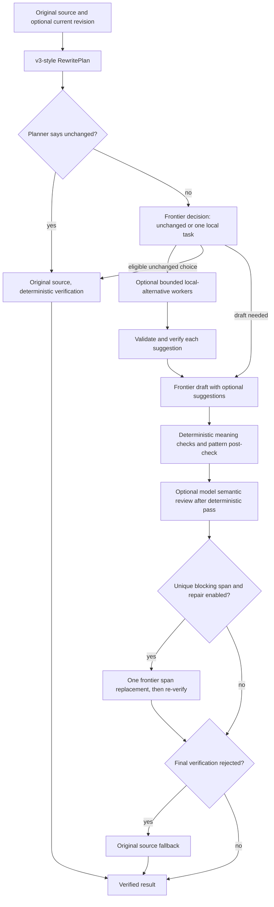

# Writing knowledge engine

See [Writing intelligence: evidence and decision policy](WRITING-INTELLIGENCE.md) for the current taxonomy, clean negatives, voice safeguards and research classifications.

Whodunnit splits writing work into two halves.

- **Deterministic analysis** measures the text and finds catalogued patterns. It is typed, versioned and testable, and it gives the same answer every time.
- **Model reconstruction** rewrites the text. The model receives a contract built from that analysis, and its output is analysed again afterwards.

The model never decides what counts as a pattern, and it never activates a rule.

```
source text
  → indexText (paragraphs, sentences, words; quotes/code/URLs masked)
  → computeMetrics                     src/lib/rules/metrics.ts
  → detectors × active rules           src/lib/rules/detectors.ts, builtins.ts
  → applyPrecedence (constraints)      src/lib/rules/constraints.ts
  → WritingAnalysis { metrics, findings, summary }
  → RewritePlan (preserve, target ranges, patterns found, prohibited, advisory, intensity)
      compiled under a versioned RewriteStrategy
  → model or demo engine
  → meaning checks + comparePatterns (resolved / remaining / introduced)
  → retry only on blocking meaning findings or newly introduced deterministic patterns
```

## Rules

`WritingRule` (`src/domain/writing-rules.ts`) is a Zod-validated record, so rules live as JSON in `data/rules/packs/*.json` and not in components. Every rule has:

- `id`, `version`, `name`, `description`, `category`, `severity` (info, suggestion or warning)
- `determinism`: `deterministic` (exact match, safe to auto-fix), `heuristic` (a measured signal with thresholds), `model-assisted`, or `advisory`. The last two are never auto-applied; they reach the model as guidance.
- `detection`: a serialisable union: `phrase`, `regex`, `density`, `metric`, `builtin`, `comparison` or `none`. There is no arbitrary code in data.
- `remediation`: guidance, plus an optional `transform` (`delete-match`, `replace-map` or `collapse-additive-openers`). The schema only allows a transform on deterministic rules.
- `source`: type, title, URL, author, licence, relation (`original`, `adapted` or `derived`) and, for imported rules, the `sourceDocumentId`.
- optional `dimension`, `layer`, `falsePositiveNotes`, `examples`, `tags`, `enabled`.

The schema rejects inconsistent rules, for example a `none` detector marked deterministic, or a transform on a heuristic rule. Regex patterns go through `checkPattern` (`src/lib/rules/regex-safety.ts`) at registration. It rejects nested quantifiers, backreferences and ambiguous alternations, then times a run against adversarial input.

### Packs

| Pack | Layer | Rules | Contents |
|---|---|---|---|
| `semantic-safety` | semantic-safety | 8 | Comparison checks (figures, dates, names, quotes, links, negation, length, key terms). These can never be suppressed. |
| `core` | general | 16 | Metric and density rules: sentence and paragraph uniformity, transition density, repeated openers, hedges, intensifiers, passive share, semicolons, triads, tool markup, wordy phrases. |
| `anti-slop` | general | 30 | Adapted from Peter Yang's no-ai-slop (MIT): announcements, throat-clearing, faux-insight, binary contrasts, colon reveals, puffery, superficial -ing analysis, weasel attribution, recap endings, dashes, dramatic fragments and more. |
| `style-*` | style | 4 | One per register (concise, academic, professional, casual). These only run for their own target. |
| `imported` | general | n | Rules activated from reviewed source candidates. |

`WritingRuleRegistry` (`src/lib/rules/registry.ts`) loads packs, rejects duplicate ids and bad regexes, and composes the active set for a style target (`packsForProfile`). `pnpm rules:list` prints the whole catalogue.

### Detection details

- **Masking:** quotations, inline and fenced code, and URLs are replaced with spaces before matching. Offsets therefore still point into the original text, but quoted speech is never "fixed".
- **Structure:** headings and list items are indexed but kept out of sentence statistics.
- **Phrase matching:** word-bounded, case-insensitive, and tolerant of curly apostrophes. It can be restricted to sentence starts.
- **Density and metric rules:** these can require minimum words, sentences and paragraphs before they fire (sentence-uniformity now needs 180 words and 12 prose sentences). Their confidence rises with distance from the threshold and is capped at 0.9.
- **Matches:** every `RuleMatch` carries `start`, `end`, `excerpt`, `confidence` and a human-readable `evidence` string ("CV 0.12 across 9 sentences; threshold 0.25").

## Metrics

`computeMetrics` (`src/lib/rules/metrics.ts`) computes, among other things:

- sentence length mean, median, sample standard deviation and coefficient of variation
- paragraph-length CV
- per-100-word rates for contractions, first person, hedges, intensifiers, dashes and semicolons
- shares of questions, fragments, stock openers and likely passives
- repeated sentence openers

The tests check the arithmetic against hand-computed values. The app shows no aggregate "AI score" and has no detector probability. The notes show counts of catalogued patterns and the raw metrics.

## Constraints and precedence

Style presets, Voiceprints and refinements each produce `TargetConstraint`s: `{dimension, min, max, layer, strength, origin}` over twelve dimensions (for example `voice.contractions` or `rhythm.sentence-variation`). Precedence, highest first:

1. **semantic-safety:** meaning checks. Nothing overrides them.
2. **user-instruction:** refinements such as "more casual", or a note.
3. **voiceprint:** measured habits, only when confidence is at least 0.6.
4. **style:** the chosen preset.
5. **general:** core and anti-slop rules.
6. **advisory**

`resolveConstraints` keeps the highest-ranked constraint per dimension and reports the rest as overridden. `applyPrecedence` marks a general-layer finding `suppressedBy` when a higher layer claims the same dimension and the text already sits inside that range. This is how a writer whose Voiceprint shows heavy dash use keeps their dashes. Suppressed findings appear in the notes as "Kept as your habit" and are not counted as patterns.

### Voiceprints

A Voiceprint measurement becomes a range around the measured value, not an exact target. The range widens as confidence falls:

- confidence 0.6 or above: a voiceprint-layer constraint.
- confidence from 0.35 to 0.6: the constraint ranks below the general rules, so weak evidence cannot override them.
- confidence below 0.35: no constraint.

Sentence-length variation is derived from the measured spread (`stdDev / mean`).

## RewritePlan

`buildRewritePlan` (`src/lib/reconstruction/rewrite-plan.ts`) produces:

- `preserve`: numbers, dates, names, quotations, links and the negation count, extracted from the source.
- `targetRanges`: the resolved constraints, each with a direction (`raise`, `lower` or `hold`).
- `avoid`: detected, unsuppressed patterns, with guidance and short excerpts of at most 90 characters.
- `prohibitedPatterns`: deterministic patterns *not* present, which the rewrite must not introduce.
- `permitted`: habits kept because a higher layer allows them.
- `advisory`: model-assisted and advisory principles.

`renderContract` turns the plan into sectioned text (PRESERVE / TARGET RANGES / PATTERNS FOUND / PERMITTED / DO NOT INTRODUCE / ADVISORY). This text goes into the prompt (`reconstruct.v2`) before the source. The model never sees rule packs or source documents.

After each attempt, `comparePatterns` re-analyses the candidate. The pipeline retries only when a blocking meaning finding occurs or a deterministic pattern is newly introduced. Remaining patterns never trigger a retry; there is no retry-until-perfect loop. The best attempt is ranked by blocking findings, then introduced deterministic patterns, then total findings.

## Demo engine

Without an API key, `applyDemoRules` (`src/lib/ai/demo-rules.ts`) runs the same analysis and applies only deterministic transforms:

- delete announcements and stock openers, but never an adverb under a negation
- map wordy phrases ("in order to" → "to")
- collapse additive-connective chains to a single "Also,"

It then applies style transforms gated by what actually fired. Semicolon splitting and plain connectives only run when the matching overuse rule fired, so one deliberate "However" or semicolon stays. Capitalisation is local: only the word that now opens a sentence changes, so a writer's lowercase style survives.

## Sources and rule candidates

```
pnpm source:scrape <url>  or  pnpm source:add <file>
  → SourceDocument (library.json: licence, usage, content hash, status)
  → normalized sections (gitignored)
pnpm source:compile <id> [--model]
  → RuleCandidate[] (gitignored, always disabled)
pnpm rules:review <id>
  → each candidate validated against the clean corpus
pnpm rules:activate <candidateId> [--name --description --guidance --severity]
  → written to data/rules/packs/imported.json after re-validation and a registry load
```

- **Usage:** `adapt-with-attribution`, `derived-rules-only` or `reference-only`. Compiling a reference-only source is refused.
- **Status:** `extracted` → `compiled` → `reviewed` (or `rejected`). Review decisions survive a recompile.
- **Heuristic compiler** (`src/lib/sources/compile.ts`): turns labelled word lists, clustered quoted phrases and bold principle leads into candidates. It ignores blockquotes and example sections, which quote AI text rather than describe patterns.
- **Model compiler** (`src/lib/sources/model-compile.ts`, prompt `compile.v1`): wraps the source in `<untrusted_source>` tags. The output must match a strict Zod schema, and every candidate's anchor must appear verbatim in its section. Provenance is set in code, not by the model.

### Security boundary

Scraped content is data:

- It is parsed, never executed. Scripts, styles, forms and iframes are dropped before conversion.
- Source text can *suggest* a candidate. It cannot modify code or configuration, reach secrets, run commands or activate a rule.
- Activation is a developer running `rules:activate`, and the rule is re-validated first.

## Scrapling ingestion

`tools/source-ingestion/` is an isolated uv project pinned to `scrapling[fetchers]==0.4.15`. It is developer tooling and never runs inside the web app.

```bash
# one-time: install uv (https://docs.astral.sh/uv/), then
uv sync --project tools/source-ingestion
pnpm source:scrape https://example.com/page --license "CC BY 4.0" --usage derived-rules-only
```

- **Fetching:** plain HTTP through Scrapling's `Fetcher`, with no stealth headers, no browser impersonation and an identifying User-Agent. It fetches one URL per run and checks robots.txt first.
- **Extraction:** finds the content root by selector, drops boilerplate, and converts to Markdown sections.
- **Cache:** raw and normalised extractions are cached in `data/sources/cache/` and `data/sources/normalized/`, keyed by URL hash, and both are gitignored. A re-scrape reports `hit`, `refreshed` or `unchanged`.

## Rewrite strategies and evaluation

A `RewriteStrategy` (`src/domain/strategy.ts`) owns every policy that shapes a rewrite:

- the prompt version;
- full or prioritised contract;
- how intensity is handled;
- constraint budgets;
- the retry policy;
- the post-check policy.

Strategies are immutable and versioned. Production uses `reconstruction-v1` (the original behaviour, prompt `reconstruct.v2`). `reconstruction-v2` (prioritised contract, minimal-change intensity, prompt `reconstruct.v3`) is experimental until an evaluation shows it is better. The route handler only chooses the default strategy.

### Experimental reconstruction-v5 discourse evidence

`reconstruction-v5` extends v3's deterministic plan with a conservative document-structure classifier and discourse observations. It can permit a narrow local rule when high-confidence document form explains it, or give the planner a distributed light-edit reason when repeated abstract framing appears across prose paragraphs. Structure, formal style, source-local voice, and a saved Voiceprint provide counterevidence. Short text remains uncertain. Surface overlap and regular paragraph counts are advisory; neither authorizes deleting content or substantial reconstruction. The v5 prompt and plan are versioned; v1–v4 behavior and the production route are unchanged. [DISCOURSE-DEVELOPMENT.md](DISCOURSE-DEVELOPMENT.md) records the development corpus, observed limits, and future holdout protocol.

### Experimental reconstruction-v6 bounded semantic review

`reconstruction-v6` retains v5's deterministic analysis and adds an optional provider-independent editorial review before its unchanged bypass or candidate generation. The reviewer may recommend an evidence-backed broader or narrower editing scope; exact source-span validation, counterevidence requirements, missing-information handling and conservative reconciliation constrain that advice. Invalid or unavailable review falls back to deterministic planning, and independent meaning verification still judges any candidate. V6's additional unmarked procedure/policy/note cues are version-gated, so v5's published classifier behavior is unchanged. No reviewer is configured in the production route. [SEMANTIC-REVIEW.md](SEMANTIC-REVIEW.md) describes the contract, development evidence, privacy boundary and future Holdout V3 protocol.

### Experimental reconstruction-v4 orchestration

`reconstruction-v4` is an experimental strategy that reuses v3's planning and `reconstruct.v4` contract. Its separate entry point is `runOrchestratedReconstruction` (`src/lib/reconstruction/orchestrator.ts`), with a provider-neutral `StructuredFrontierAgent` adapter in `cloud-agent.ts`. The production route still selects v1. Evaluation can wire explicit cloud models through `--strategy reconstruction-v4` and optional `--worker-model`; no model is chosen for production.



The frontier makes the decision, drafts the document, and may repair one exact offending span. The decision schema permits one `local-alternative` task. It carries an exact source or current-revision span of at most 300 characters and less than 45% of that text, plus a fixed purpose enum (`plain-language`, `flow`, `brevity`). A worker receives only that span and enum. Routing considers live, eligible routes with a positive timeout and either unknown or at least 0.9 configured reliability; it prefers cheap, then fast, strong and frontier tiers, breaking ties by timeout. A failed first worker can try at most one stronger eligible route. A span must occur exactly once in the relevant text. Worker output is schema-validated, checked against the span for deterministic meaning failures and claim/assertion changes, then passed to the frontier as an untrusted, optional wording suggestion. Missing routes and rejected suggestions do not block drafting.

The pipeline verifies the draft against the **original** source using the plan's removable spans, refinement licences and protected phrases. It runs at most one pipeline attempt. An optional semantic reviewer runs only after deterministic verification does not reject the draft; its findings can add failures, never erase deterministic ones. If a configured semantic reviewer is unavailable, the result falls back to the original. A repair is considered only for a blocking finding with a unique candidate span in the draft. The replacement must reduce the blocking count locally and after the full pipeline check; if a semantic reviewer is configured, the follow-up model review must also run before acceptance. A final rejected result becomes the original source with fresh deterministic verification and pattern comparison. Decision or draft failure also yields source text. The normal minimal-change planner can return the original before any frontier call.

The orchestrator's trace contains route IDs, tiers, outcomes, use flags, token counts when reported, latency, delegation and repair counts, verification status and final decision; it contains no source or candidate text. Estimated USD cost is computed only when every call has token counts and configured input/output prices, otherwise it is `null`. Bounds are per-call timeouts, one delegated task, one stronger worker retry, one draft attempt and at most one localized repair; there is no aggregate dollar or wall-clock budget enforced here. The frontier sees the full source and plan, and optional semantic review sees source plus candidate. Evaluation records, unlike the metadata trace, contain synthetic fixture text and outputs in gitignored `.evaluations/`; user documents are outside that corpus. See [EVALUATION.md](EVALUATION.md) for evaluation configuration and [BENCHMARK-PLAN.md](BENCHMARK-PLAN.md) for the deferred comparison.

`runReconstructionDetailed` exposes the plan and a per-attempt log. The log holds trigger, retry reasons, failure kinds, output hash, latency, tokens and request id, and never any text.

The evaluation harness (`src/lib/evaluation`, `tools/eval/cli.ts`, `data/evaluation`) runs a versioned corpus through a strategy and provider. It records semantic gates, rule diffs, metric deltas, wording retention and voice comparison per case, and stores them in the gitignored `.evaluations/`. It compares runs by dimension and flags regressions against baselines. See [EVALUATION.md](EVALUATION.md).

## Semantic integrity and refinement deltas

`src/lib/semantics` is the claim-level meaning layer. It is deterministic and browser-safe, and it runs inside `verifyDeterministic`, so the web app's hand-edit checks use it too.

| Module | What it does |
|---|---|
| `claims.ts` | SemanticClaim extraction |
| `quantities.ts` | values, units and bounds |
| `dates.ts` | date normalisation |
| `compare.ts` | claim alignment and change detection |
| `quotes.ts` | quotation integrity |
| `phrases.ts` | protected phrases and contrast substitution |
| `mechanics.ts` | mechanical damage |
| `integrity.ts` | runs the modules and maps findings: blocking → blocking, major → warning |

Rule families (`data/rules/families.json` and `src/lib/rules/families.ts`) group rules that make the same move in different words, and mark which families are filler a rewrite may delete. The `families` pack adds a few high-value variants: comparative contrast, paired negations, unsourced authority, importance signalling and optimisation clichés. Determinism stays per rule.

`src/lib/reconstruction/refinement-delta.ts` models each refinement as a delta:

- objectives, each with a reference (original or current)
- licences taken from the author's own words
- restorations toward the original
- claim triage for shortening

The plan carries the delta, protected phrases, active families, removable spans and a minimal-change decision. The pipeline verifies with that same context. The evaluation-only `SemanticJudge` (`src/lib/evaluation/judge.ts`) runs any provider that implements `StructuredCaller`, and never overrides a deterministic failure. See [EVALUATION.md](EVALUATION.md).
