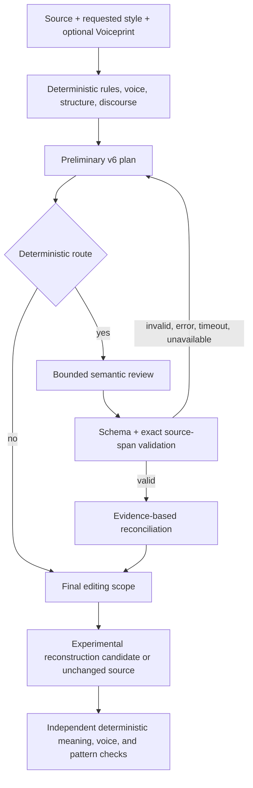

# Experimental bounded semantic review

Production remains `reconstruction-v1`. Published `reconstruction-v5` still uses its original deterministic document classifier and planner. `reconstruction-v6` adds an optional, explicitly injected editorial reviewer after v5-style analysis. It is not enabled by the web route. Local-model benchmarking remains **PAUSED UNTIL 64 GB M5 PRO ENVIRONMENT**.

The reviewer assesses **editing reasons**, not authorship. Its schema distinguishes local wording, semantic restatement, broad generic framing, register inflation, empty significance, mechanical structure, missing information, and voice. A review carries exact source spans, reason, severity, confidence, counterevidence, paragraph information roles, and whether missing facts prevent safe improvement. Offsets are zero-based UTF-16 indices into the original, unnormalized string. The whole review is rejected if any span fails exact comparison. A source citation proves grounding, not that the editorial judgment is correct. Review prompt v2 explicitly asks the model to judge the source's writing rather than defects in a document that the source describes.

The reviewer sees only the source, v6 preliminary disposition and rationale, local and discourse finding summaries, document type and confidence, source-local voice evidence, limited Voiceprint habits, and protected content. It never sees gold labels. The `SemanticReviewClient` can wrap any `StructuredCaller`; no vendor is part of the schema or reconciliation policy. A model sees user text when routed. Review calls require explicit injection; no production config can silently turn them on.

Selective routing currently requests review for advisory discourse evidence, unchanged prose of at least 150 words, broad reconstruction proposals, or local findings with voice or genre uncertainty. `all` mode supports development comparison. The router uses metadata from deterministic analysis and never emits raw text. The default null client leaves the deterministic decision in force. A real review is bounded by a timeout; the current `StructuredCaller` interface does not carry an abort signal, so timeout prevents using a late answer but may not cancel the underlying provider request.

Reconciliation can widen or narrow editing scope only when the complete review validates. Widening requires confidence at least 0.7 plus a moderate or major finding with exact source evidence. Substantive reconstruction additionally needs a major distributed finding evidenced in at least two paragraphs and no listed missing information. A brake requires an editorial reason and counterevidence overlapping every local finding example. A deterministic local trigger remains active; heuristic triggers can be vetoed. Preservation invariants, quotes, dates, quantities, claims, and protected phrases are never waived. When the reviewer says new facts are needed, it cannot broaden scope. A review failure, unavailable provider, malformed JSON, bad span, or timeout returns the deterministic plan; no error text enters telemetry.

The v6 prompt receives only validated high-confidence editorial findings and the final scope. It still uses the existing independent meaning checks and retry limits after candidate generation. Reviews cannot produce the final text and cannot declare verification passed. The demo provider stays deterministic; its results are not evidence of a cloud reconstruction's quality.

## Development material and measurement

`data/fixtures/semantic-review-development/corpus.json` contains 176 newly authored synthetic documents. Four isolated creator tasks wrote 40 each from editorial briefs only; a fifth created 16 structural examples. They did not read engine rules, frozen holdouts, development fixtures, or engine output. Two blind annotation tasks labeled 80 each from ID and text only; the structural supplement was also annotated independently. A separate second reviewer labeled 40 of the first 80 without seeing the first labels or planner decisions. Six disposition disagreements were retained as `AMBIGUOUS`; concept labels are weaker evidence than dispositions. All 176 examples are **development data**, open to iteration, never an independent generalization claim.

`pnpm eval:semantic-development` runs v5 and v6 deterministic planning on this corpus and reports separate restraint, coverage, scope, routing, and length summaries. It invokes no model. Passing a synthetic review artifact path replays that artifact through v6 validation and reconciliation, comparing all-review and selective-route policies on the same reviewed items. Missing artifacts are counted as fallbacks. The CLI emits metadata and fixed error codes, not source text. The reviewer artifact includes synthetic source quotations and belongs only in development files.

The corpus has 73 `LEAVE_ALONE`, 42 `LIGHT_EDIT`, 43 `SUBSTANTIVE_RECONSTRUCTION`, and 18 `AMBIGUOUS` cases. It spans very short, short, medium and long documents; 16 exceed 600 words. The independent second reviewer agreed on disposition in 34/40 cases and on exact normalized concept sets in 22/40. Six disputes involved light editing versus leaving alone. This is editorial disagreement, not a detector error.

### Development results (synthetic replay)

The deterministic development baseline leaves 69/73 clean documents unchanged, edits 14/85 unambiguous problematic documents, and assigns substantive scope to 0/43 substantive cases. V5 and v6 without a reviewer agree on these dispositions. Selective routing requests review for 75/176 documents (42.6%). The route reaches only 2 very-short documents; local deterministic findings can still act there.

An agent-family reviewer returned 160 schema-valid reviews; the 16 structural supplement documents have no review artifact because the agent call stopped at its usage limit. Evaluation counts those 16 as deterministic fallbacks. This replay is **development evidence**, and the review instructions used to generate the artifact were not the final provider prompt v2. It cannot establish production provider quality.

| Measure | Deterministic v5/v6 | All-review replay | Selective-route replay |
| --- | ---: | ---: | ---: |
| Clean unchanged | 69/73 | 70/73 | 70/73 |
| Problematic with any edit | 14/85 | 37/85 | 24/85 |
| Light cases assigned light scope | 5/42 | 19/42 | 12/42 |
| Substantive cases assigned substantive scope | 0/43 | 0/43 | 0/43 |

The replay has 23 scope escalations, one brake, zero *additional* clean false escalations after reconciliation, and zero false de-escalations. Three clean documents still receive edit pressure, including one broad deterministic decision. Missing information is recognized in 36/47 independently annotated cases. All-review meaningfully improves light-edit coverage but still does not calibrate substantive scope. Selective routing misses 13 problematic edits found by all-review. It therefore offers a cost/quality tradeoff, not a proved optimal route.

Before the final missing-information guard, the same review artifact caused two clean critiques of other documents to be escalated to substantive reconstruction. The reviewer confused flaws *described in the source* with flaws *in the source's prose*. Blocking broad escalation when missing information is listed removes those two false escalations in replay, but also removes two otherwise correctly labeled substantive decisions. The source-target prompt instruction was added afterward and has **not** been tested with a live reviewer. This is a general semantic safety issue, not an invitation to train on these examples. The saved replay is useful for reproducing the reconciliation result, not for claiming prompt efficacy.

The enhanced v6 structure classifier identifies 16/61 requested non-prose genres, against 4/61 for the pinned v5 classifier. On the 18 cases retaining line formatting, it identifies 16/18; 15 high-confidence predictions are correct. The earlier creators flattened 43 genre examples into single paragraphs, so the 61-case denominator mixes structural evidence with absent formatting and should not be interpreted as general genre accuracy. The 16-example structural supplement is development material used during classifier work, not blind validation.

Deterministic planning has median/p95/worst latencies of 3.33/57.9/236.94 ms for very short, 5.51/9.01/11.71 ms for short, 10.65/18.36/24.67 ms for medium, and 19.63/35.19/35.19 ms for long documents in one local run. The outlying very-short duration is startup/noise; these are not provider latency measurements. The replay artifacts contain no model token counts or per-call latency, so cloud cost and reviewer latency remain unknown. The telemetry contract records them when a provider supplies them.

No second model-family review result was obtained: a bounded Claude consult exhausted its budget without returning judgments. The independent architecture consult did complete and identified evidence grounding, fail-closed behavior, protected facts, and privacy as primary risks. A final independent diff review was rejected by automatic approval review because it would transmit repository source to a paid external reviewer under the no-paid-API restriction. The requested independent red-team agent also stopped at its usage limit. These missing checks prevent a claim that v6 is ready to replace v5 planning. A fresh blind Holdout V3 and a complete independent review are required before promotion.

## Observability and privacy

The `onSemanticPlan` callback receives an allowlisted record: requested flag, outcome code, configured model, input/output token counts when supplied, latency, optional estimated cost from caller-supplied pricing, and preliminary/final scope. It contains no document, excerpt, evidence, rationale, exception message, or missing-information text. Pricing is caller configuration. Token and cost values remain `null` when the provider does not supply usage. Evaluation artifacts may contain only synthetic material; never use user drafts.

## Holdout V3 protocol (future session only)

Do **not** create V3 in this development session. A separate team should author new documents from an editorial brief without access to this implementation, this corpus, V1/V2 holdouts, or model-review outputs. Cover clean restraint, semantic genericness, lexical-variable restatement, one weak section amid useful prose, genuinely distributed substantive problems, missing-information cases, formal and academic writing, intentional repetition, procedures, interviews, emails, policies, and short-text uncertainty. Include hard clean counterparts and genuinely long documents.

At least two blind annotators should label disposition, concepts, genre, missing information, and safe editing scope. Preserve genuine disagreement as ambiguous. Freeze documents, labels and reviewer records with SHA-256 fingerprints **before** any v6 run. Run v5, v6 all-review, and v6 selective-review once with pinned prompt/schema/model settings; never send gold labels in reviewer or reconstruction prompts. Report intent-to-treat outcomes including malformed, timed-out and missing reviews, plus escalation/brake correctness, scope calibration, cost, latency and routing coverage. Do not tune on V3 after its first run.
