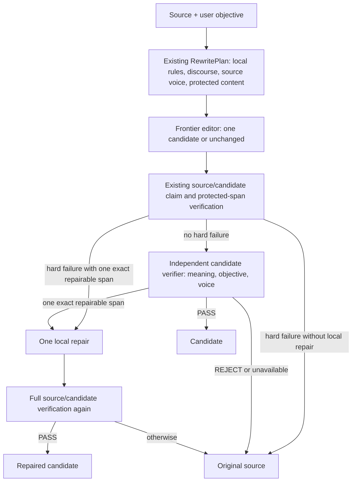

# Verified reconstruction v10: synthetic development experiment

V10 tests the product loop on **actual candidate text**. It is experimental and has no web route. The production route still selects v1; v4–v9 and their prompts remain pinned. No frozen holdout, local model, metered API, deployment, or push was used.

## Architecture

The runner reuses `buildRewritePlan`, `verifyDeterministic` and `integrityReport` for claims, negation, certainty, causation, quantities, dates, names, quotation and protected-phrase checks; `compareVoiceDevices` for source-local voice; and the existing style and Voiceprint data. The editor sees the explicit objective, compact findings, source voice, protected content, and optional semantic diagnosis. It is free to leave good writing unchanged. It is **not** bound to v5's per-job authorization schema. The actual candidate receives the semantic check. A changed or unchanged candidate requires a separate semantic verifier caller before acceptance; a hard deterministic failure cannot be cleared by that caller. Only one exact local repair is allowed, followed by full reverification. All other failures return the original source.

The verifier's pinned v2 contract asks comparative questions about meaning, unsupported information, objective satisfaction, and voice. Deterministic `preserved`/`review`/`rejected` map to PASS/NEEDS_REVIEW/FAIL; even a deterministic PASS still gets semantic review because objective satisfaction is usually editorial. V10 records existing integrity changes rather than introducing another writing ontology. The trace contains route IDs, lengths, counts, verdicts, fallback reasons, token totals when supplied, and stage timings; it contains no source, objective, or candidate text. Synthetic evaluation files intentionally contain all three texts. A live route is denied unless its caller explicitly identifies as account-backed and its no-incremental-cost status is confirmed. No live `StructuredCaller` was configured in this experiment.

## Development method

An independent creator wrote **32 synthetic cases** in twelve categories: already-good 3, local-formulaic 3, distributed-generic 3, casual/personal 3, professional 3, academic 3, technical 3, email 3, voice-like 2, explicit-refinement 2, unsafe-request 2, and long-form 2. Four account-backed editor agents received only the pinned v10 editor contract and source/objective requests. Four separate verifier agents received only source/candidate comparisons and the pinned verifier contract. A separate agent repaired two exact spans; a different verifier reviewed the full repaired candidates. This account-agent transport has no token accounting and cannot establish provider-family independence or live API latency. It incurred **$0 incremental API spend**.

Two blind editorial auditors each judged sixteen source/objective/candidate/final sets without traces or expected labels. A third independently reassessed twelve selected cases; it agreed on whether the candidate improved and preserved meaning for all twelve. The initial run is saved separately from the post-code-review replay; the same model outputs produced the same text and decisions in both.

| Stage or outcome | Cases/calls |
| --- | ---: |
| Frontier candidates / unchanged candidates | 32 / 9 |
| Deterministic PASS / NEEDS_REVIEW / FAIL | 23 / 3 / 6 |
| Semantic verifier calls / PASS / LOCAL_REPAIR / REJECT | 28 / 26 / 0 / 2 |
| Local repairs attempted / accepted | 2 / 2 |
| Accepted first candidates / repaired candidates / unchanged / source fallback | 15 / 2 / 9 / 6 |

The blind first audit judged **21/32 raw candidates** to improve the writing and **15/32 final outputs** to improve it. Raw versus final objective satisfaction was **31/32 versus 25/32**; voice preservation **30/32 versus 32/32**; naturalness **32/32 versus 28/32**. It found **zero unsupported facts** in both raw and final text. It marked two raw candidates as meaning-changing, both deliberately replacing the source's harmful request with the user's requested legitimate request; no accepted final output changed source meaning. It found no overediting under its rubric, but one raw and seven final outputs underedited. Final text was preferred in two cases, raw candidate in six, and they were tied in 24. These are subjective judgments on synthetic development writing, not population estimates or a model benchmark.

Representative successes: vrd-004 cuts empty setup while retaining schedule facts; vrd-007 replaces generic promotion with source details; vrd-020 repairs a validation distinction and keeps the exact error code; vrd-032 restores the limited force of a volunteer's observation after a localized strengthening. Already-good vrd-001–003 and other voice-sensitive passages were left alone.

Representative failures: vrd-008 and vrd-009 lost useful edits because the deterministic claim matcher treated empty framing as material missing claims. Vrd-023 lost a courteous email formatting edit because name extraction treated greeting/signature punctuation as changed names. Vrd-027 lost a good two-sentence edit when the semantic verifier judged the first sentence too long despite the objective's “if possible” qualifier. Vrd-029/030 requested a change of intent; the current hard meaning-preservation policy cannot authorize that, so both fell back to the original source. These are **good-edit rejection and objective-policy** problems, not observed unsupported-information escapes. Two accepted edits (vrd-012, vrd-024) were not clear improvements in the blind audit.

The independent code reviewer found a possible voice-damage acceptance path, missing Voiceprint context in verifier requests, a same-caller independence gap, and replay completeness weaknesses. These general defects were fixed without changing the editor or verifier prompt or rerunning model generation. The initial replay remains saved. The reviewer also noted that source fallback discards the current revision during a refinement; this remains the explicit v10 fail-closed source policy and is a known product limitation. The review correctly cautioned against inferring cost or live latency from replay timings.

## Decision

**Continue v10 as an experiment; do not promote it.** This set demonstrates useful editing, restraint, two accepted local repairs, and a functioning hard-failure fallback. It does **not** demonstrate a naturally occurring unsupported fact caught by Whodunnit: the frontier editors made none in this set. The main observed cost is six good raw edits lost to hard checks or verifier judgment. There were no bad-edit escapes identified by the blind auditors, but 32 synthetic cases cannot establish an escape rate. The exact next experiment is a fresh, small set of actual edits that stresses semantic change versus removable framing, email/structured formatting, and objective-authorized changes of intent. Compare raw and final text with independent blind review before any Holdout V3 decision. Do not add another pre-edit ontology or optimize routing.
